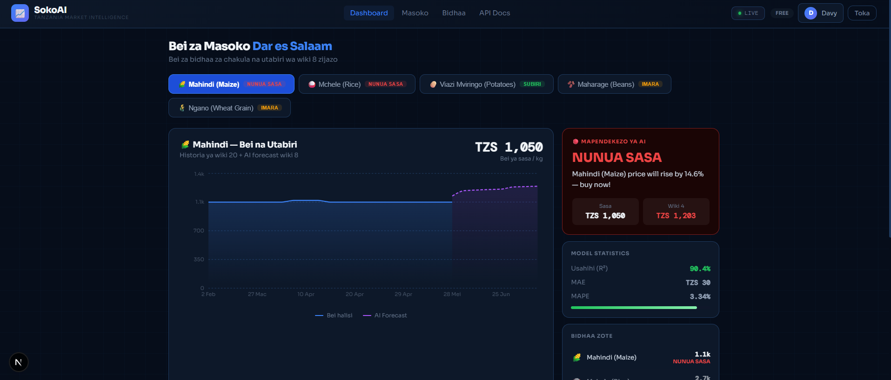

# SokoAI — Intelligent Commodity Price Forecasting for Dar es Salaam

SokoAI is a full-stack forecasting platform that brings real-time wholesale commodity intelligence to traders, retailers, and decision makers in Tanzania. It combines automated data ingestion, predictive analytics, and a modern dashboard to surface price signals, market insights, and smart alerts for key food commodities.



## Why SokoAI?
- Predicts commodity prices for the next 4–16 weeks using local market history.
- Generates clear, actionable alerts: **BUY NOW**, **WAIT**, **STABLE**.
- Supports data-driven pricing decisions for Dar es Salaam wholesale markets.
- Bridges raw market feeds, machine learning, and a polished web experience.

## Core Features
- **FastAPI backend** with production-ready REST endpoints.
- **Next.js frontend** delivering responsive charts, market lists, and alert dashboards.
- **Automated data pipeline** for scraping, parsing, and storing price feeds.
- **Historical market analysis** across several DSM markets and commodity categories.
- **PWA-ready frontend** for fast mobile access and offline-friendly behavior.

## Project Overview
| Area | Location | Purpose |
|---|---|---|
| Backend API | `api/` | FastAPI server with pricing, forecasts, alerts, and auth routes |
| Data scripts | `scripts/` | Data ingestion, parsing, training, and update automation |
| Frontend | `SokoAI_NextJS_Project/sokoai-app/` | React/Next.js dashboard and user interface |
| Data | `data/` | Market datasets and historical CSV files |
| Docs | `docs/` | Architecture, reports, and screenshots |

## Technology Stack
- **Backend**: Python, FastAPI, PostgreSQL, Redis
- **Frontend**: Next.js, React, Tailwind CSS, Recharts
- **ML / Data**: Pandas, Scikit-Learn, Prophet/XGBoost hybrid logic
- **Deployment**: Vite-like production bundling, Docker-ready patterns

## Getting Started
### 1. Backend Setup
```bash
cd /path/to/sokoAI
python -m pip install -r requirements.txt
python -m uvicorn api.main:app --reload --host 127.0.0.1 --port 8000
```

If you do not have a `requirements.txt`, install the core dependencies manually:
```bash
pip install fastapi uvicorn psycopg2 python-dotenv bcrypt jwt
```

### 2. Frontend Setup
```bash
cd SokoAI_NextJS_Project/sokoai-app
npm install
npm run dev
```

Open the dashboard at:
- `http://localhost:3000`

### 3. API Health Check
Verify backend availability:
```bash
curl http://127.0.0.1:8000/health
```

## Folder Structure
```text
.
├── api/                    # FastAPI application and auth routes
├── cache/                  # Redis cache helpers and proxy logic
├── consensus/              # Forecast engine and prediction helpers
├── data/                   # CSV market data and raw datasets
├── docs/                   # Project docs, screenshots, and architecture
├── pwa/                    # Progressive Web App service worker / offline utilities
├── scripts/                # Data ingestion, parsing, and training scripts
├── SokoAI_NextJS_Project/   # Frontend app built with Next.js
└── README.md
```

## Running the Full Stack
1. Start the backend API:
   ```bash
   cd /path/to/sokoAI
   python -m uvicorn api.main:app --reload --host 127.0.0.1 --port 8000
   ```
2. Start the frontend app:
   ```bash
   cd SokoAI_NextJS_Project/sokoai-app
   npm install
   npm run dev
   ```
3. Visit `http://localhost:3000`.

## API Authentication
The main FastAPI server uses `X-API-Key` for commodity endpoints. The registration flow creates a client API key and returns it on signup.

## Screenshots
Add your visuals here after generating them:

```md


```

## Notes
- Use `.env.local` in the frontend for environment overrides.
- Use the root `.env` file to configure `DATABASE_URL` and secret values.
- Replace placeholder screenshot files in `docs/` with real images once available.

## Next Improvements
- Add a hosted demo link.
- Document deployment steps for Docker and Vercel.
- Expand API docs with OpenAPI / Swagger examples.

---

### Ready to publish
This README is ready for a world-class public repository. Add your screenshots into `docs/` and update the image paths above to make the presentation complete.
